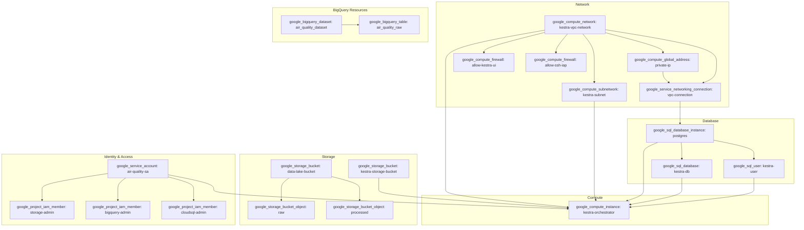

# Air Quality Monitoring System

This project collects and analyzes air quality data from cities around the world using IQAir API. It implements a full Data Engineering pipeline with extraction, loading, transformation, and visualization capabilities.

## Architecture


The project uses the following technologies:
- **Google Cloud Platform** (GCS, BigQuery, Compute Engine)
- **dlt** (Data Load Tool) for extracting data from IQAir API
- **dbt** (Data Build Tool) for transforming data in BigQuery
- **Kestra** for workflow orchestration
- **Terraform** for infrastructure provisioning
- **Docker** for containerization

## Project Structure

```
├── dbt_models               # dbt models for data transformation
├── dlt_pipeline             # dlt scripts for data extraction
├── docker                   # Dockerfiles for different components
├── docs                     # Documentation
├── kestra                   # Kestra workflow definitions
│   └── flows
├── scripts                  # Utility scripts
├── secrets                  # Sensitive data (not committed to repo)
└── terraform                # Terraform configuration
└── modules
```
## Setup and Installation

### Prerequisites

- Google Cloud Platform account with billing enabled
- Terraform installed
- Docker and Docker Compose installed
- IQAir API key

### Local Development

1. Clone the repository:

```
git clone https://github.com/yourusername/air-quality-monitoring.git
cd air-quality-monitoring
```

2. Create `.env` file with required environment variables:

```
GCP Settings
GCP_PROJECT_ID=your-project-id
GOOGLE_APPLICATION_CREDENTIALS=./secrets/credentials.json
BigQuery Settings
BIGQUERY_DATASET=air_quality_dataset
BIGQUERY_LOCATION=EU
GCS Settings
GCS_BUCKET_NAME=air-quality-data-lake
GCS_BUCKET_PATH=gs://air-quality-data-lake/air-quality
IQAir API
IQAIR_API_KEY=your-api-key
Kestra Settings
KESTRA_WEBHOOK_URL=your-slack-webhook-url
```

3. Start the local development environment:

```
docker-compose up -d
```
4. Access the services:
- Kestra UI: http://localhost:8080
- dbt docs: http://localhost:8580

### Cloud Deployment

1. Create a service account in Google Cloud with the necessary permissions:

```
./scripts/create-sa-gcloud.sh
```

2. Download the service account key and place it in `./secrets/credentials.json`

3. Deploy the infrastructure with Terraform:

```
cd terraform
terraform init
terraform apply
```
4. Deploy the Kestra flows to the VM:

```
scp -r ./kestra/flows user@kestra-vm-ip:/path/to/kestra/flows

```
5. Set up the environment variables on the VM:

```
ssh user@kestra-vm-ip 'bash -s' < ./scripts/setup-env.sh
```

Deployment schema:



## Pipeline Components

### Data Extraction (dlt)

The data extraction pipeline collects air quality data from IQAir API and stores it in Google Cloud Storage. The data is collected daily and partitioned by date.

To run the extraction pipeline manually:

```
docker-compose exec dlt-dev python -m dlt_pipeline.air_quality.pipeline
```

### Data Transformation (dbt)

The transformation layer consists of dbt models that clean and transform the raw data into a dimensional model for analysis. The models include:

- Staging models: Clean and prepare the raw data
- Dimensional models: Create geographical and time dimensions
- Fact models: Create fact tables with air quality measurements
- Data marts: Create denormalized views for reporting

To run the dbt models manually:

```
docker-compose exec dbt-dev bash -c "cd /app/dbt_models && dbt run --profiles-dir=."
```

### Workflow Orchestration (Kestra)

Kestra orchestrates the entire pipeline with the following workflows:

- `air_quality_extract_load`: Extracts data from IQAir API and loads it to GCS/BigQuery
- `air_quality_transform`: Transforms data using dbt models
- `air_quality_main_flow`: Main orchestration flow that runs daily

## Dashboard and Visualization

The transformed data can be visualized using Looker Studio or any other BI tool. Connect to the `air_quality_mart` table in BigQuery for the most comprehensive view of the data.k


## Maintenance and Monitoring

- Logs are available in Kestra UI
- Notifications are sent to Slack on workflow completion
- dbt documentation provides information about the data models

## License

This project is licensed under the MIT License - see the LICENSE file for details.
